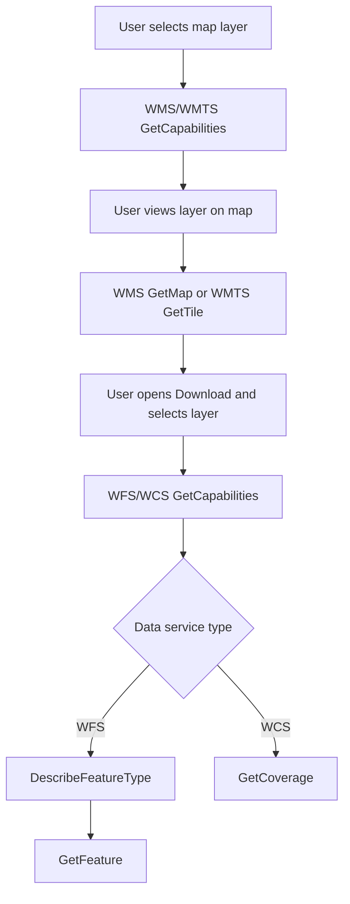

# OpenEarth Viewer

The [OpenEarth Viewer](https://rws-viewer.netlify.app/) gives insight in a wide variety of marine data. It is configured to be loaded into a variety of different websites and cater specific layer data to each individual client.

[](https://app.netlify.com/sites/rws-viewer/deploys)

## Getting started

- Clone [this repository](https://github.com/openearth/rws-viewer):

```sh
git clone git@github.com:openearth/rws-viewer.git
cd rws-viewer
npm install --legacy-peer-deps
```

- Copy `.env.example` to `.env`. And set all variables.

### Local development

```sh
npm run dev
```

## Migrations

This project uses [DatoCMS migrations](https://www.datocms.com/docs/content-management-api/migrations) for managing the models and moving data around in the DatoCMS instances. It uses custom scripts to generate the migrations, and to apply them.

### Create Migration (`migrations:create`)

**File:** `scripts/dato/create.ts`

This script creates a new migration file for DatoCMS.

- Prompts the user for a migration name.
- Uses the current DatoCMS instance specified in the environment variable `DATO_INSTANCE_CURRENT`.
- Creates a new migration file using the DatoCMS CLI.

Usage:

```bash
npm run migrations:create
```

### Apply Migrations To Staging (`migrations:apply-staging`)

**File:** `scripts/dato/apply-staging.ts`

This script applies migrations to the staging environment for all configured DatoCMS instances.

For each instance:

1. Sets up a staging environment.
2. Destroys the existing staging environment if it exists.
3. Creates a fresh staging environment by forking from the main environment.
4. Applies all migrations in the `migrations` directory to the staging environment.

Usage:

```bash
npm run migrations:apply
```

### Apply Migrations to Main (`migrations:apply-main`)

🚧 Please do not use this script unless you know what you are doing. This will update the main environment for all configured DatoCMS instances and can cause data loss. Typically this will only be run from a GitHub action.

**File:** `scripts/dato/apply-main.ts`

This script applies migrations to the main environment for all configured DatoCMS instances.

For each instance:

1. Destroys the existing staging environment if it exists.
2. Creates a fresh staging environment by forking from the main environment.
3. Applies all migrations in the `migrations` directory to the staging environment.
4. Promotes the staging environment to main.
5. Destroys the old main environment.
6. Renames the staging environment to main.

Usage:

```bash
npm run migrations:apply-main
```

## GitHub Actions Workflows


### Deploy to Production

The `main-migrations.yaml` workflow is triggered on a push to the `main` branch. It performs the following steps:

1. Checks out the repository.
1. Checks for changes in the `migrations` folder.
1. If changes are detected, sets up Node.js, installs dependencies, and runs the `migrations:apply-main` script.
1. Deploys the application to Netlify using the specified instances.

### Deploy to Staging

The `staging-migrations.yaml` workflow is triggered on pull request events (opened or synchronized). It performs the following steps:

1. Checks out the repository.
1. Checks for changes in the `migrations` folder.
1. If changes are detected, sets up Node.js, installs dependencies, and runs the `migrations:apply-staging` script.
1. Deploys the application to Netlify using the specified instances.

## OGC Architecture

This application is an OGC-based map viewer and downloader that integrates WMS, WMTS, WFS, and WCS services behind a single user flow.

### High-level flow

1. Load viewer configuration and layer catalog.
1. Select a layer to fetch map capabilities (`GetCapabilities`).
1. Render map tiles (`GetMap` for WMS, `GetTile` for WMTS).
1. Open Download and fetch data capabilities (`GetCapabilities` for WFS/WCS).
1. Download data with `GetFeature` (WFS) or `GetCoverage` (WCS).

### Component responsibilities

- **Data store (`data` module):** loads viewer configuration and manages catalog and flattened layers.
- **Map store (`map` module):** handles layer activation, capabilities enrichment, and map layer state.
- **Capabilities utilities:** normalize WMS/WMTS/WFS/WCS capability responses into app-level metadata.
- **Map layer builders:** build Mapbox-compatible definitions for WMS/WMTS raster/vector layers.
- **Download view:** resolves formats, filters, and builds final OGC download URLs.

### Current implementation note

- `DescribeFeatureType` is implemented and used for WFS downloads.
- `DescribeCoverage` is currently not implemented in this codebase.
- WCS downloads use `GetCapabilities` plus `GetCoverage`.

### User actions and OGC calls

| User action | OGC endpoint call | Response |
| --- | --- | --- |
| Select a layer on the map | `WMS/WMTS GetCapabilities` | Layer metadata (bbox, version, dimensions, formats) |
| View selected layer | `WMS GetMap` or `WMTS GetTile` | Renderable map tiles |
| Open Download and choose layer | `WFS/WCS GetCapabilities` | Supported output formats |
| Configure filters (WFS only) | `WFS DescribeFeatureType` | Filterable attributes |
| Start download (WFS) | `WFS GetFeature` | Vector dataset payload |
| Start download (WCS) | `WCS GetCoverage` | Raster coverage payload |

### Simplified schema



