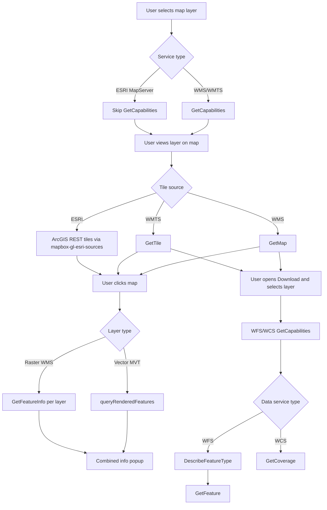

# OpenEarth Viewer

The [OpenEarth Viewer](https://rws-viewer.netlify.app/) gives insight in a wide variety of marine data. It is configured to be loaded into a variety of different websites and cater specific layer data to each individual client.

[](https://app.netlify.com/sites/rws-viewer/deploys)

## Getting started

- Clone [this repository](https://github.com/openearth/rws-viewer):

```sh
git clone git@github.com:openearth/rws-viewer.git
cd rws-viewer
npm install --legacy-peer-deps
```

- Copy `.env.example` to `.env`. And set all variables.

### Local development

```sh
npm run dev
```

## Supported Layer Types

The viewer supports three types of map services:

- **WMS** (Web Map Service) - Standard OGC WMS services
- **WMTS** (Web Map Tile Service) - URLs containing `wmts` in the pathname
- **ESRI MapServer** - URLs containing `MapServer` in the pathname (GetCapabilities is automatically skipped)

Service type is automatically detected from the URL pattern. All layers require:
- `id`: Unique identifier
- `name`: Display name
- `url`: Service URL
- `layer`: Layer name/ID (not used for ESRI layers)

## Migrations

This project uses [DatoCMS migrations](https://www.datocms.com/docs/content-management-api/migrations) for managing the models and moving data around in the DatoCMS instances. It uses custom scripts to generate the migrations, and to apply them.

### Create Migration (`migrations:create`)

**File:** `scripts/dato/create.ts`

This script creates a new migration file for DatoCMS.

- Prompts the user for a migration name.
- Uses the current DatoCMS instance specified in the environment variable `DATO_INSTANCE_CURRENT`.
- Creates a new migration file using the DatoCMS CLI.

Usage:

```bash
npm run migrations:create
```

### Apply Migrations To Staging (`migrations:apply-staging`)

**File:** `scripts/dato/apply-staging.ts`

This script applies migrations to the staging environment for all configured DatoCMS instances.

For each instance:

1. Sets up a staging environment.
2. Destroys the existing staging environment if it exists.
3. Creates a fresh staging environment by forking from the main environment.
4. Applies all migrations in the `migrations` directory to the staging environment.

Usage:

```bash
npm run migrations:apply
```

### Apply Migrations to Main (`migrations:apply-main`)

🚧 Please do not use this script unless you know what you are doing. This will update the main environment for all configured DatoCMS instances and can cause data loss. Typically this will only be run from a GitHub action.

**File:** `scripts/dato/apply-main.ts`

This script applies migrations to the main environment for all configured DatoCMS instances.

For each instance:

1. Destroys the existing staging environment if it exists.
2. Creates a fresh staging environment by forking from the main environment.
3. Applies all migrations in the `migrations` directory to the staging environment.
4. Promotes the staging environment to main.
5. Destroys the old main environment.
6. Renames the staging environment to main.

Usage:

```bash
npm run migrations:apply-main
```

## GitHub Actions Workflows


### Deploy to Production

The `main-migrations.yaml` workflow is triggered on a push to the `main` branch. It performs the following steps:

1. Checks out the repository.
1. Checks for changes in the `migrations` folder.
1. If changes are detected, sets up Node.js, installs dependencies, and runs the `migrations:apply-main` script.
1. Deploys the application to Netlify using the specified instances.

### Deploy to Staging

The `staging-migrations.yaml` workflow is triggered on pull request events (opened or synchronized). It performs the following steps:

1. Checks out the repository.
1. Checks for changes in the `migrations` folder.
1. If changes are detected, sets up Node.js, installs dependencies, and runs the `migrations:apply-staging` script.
1. Deploys the application to Netlify using the specified instances.

## Service architecture

This application is a map viewer and downloader that integrates OGC services (WMS, WMTS, WFS, WCS) and ESRI MapServer behind a single user flow.

### High-level flow

1. Load viewer configuration and layer catalog.
1. Select a layer to fetch map capabilities (`GetCapabilities` for WMS/WMTS; skipped for ESRI MapServer).
1. Render map tiles:
   - WMS → `GetMap`
   - WMTS → `GetTile`
   - ESRI MapServer → ArcGIS REST tiles via `mapbox-gl-esri-sources`
1. Open Download and fetch data capabilities (`GetCapabilities` for WFS/WCS; not available for ESRI layers).
1. Download data with `GetFeature` (WFS) or `GetCoverage` (WCS).

### Component responsibilities

- **Data store (`data` module):** loads viewer configuration and manages catalog and flattened layers.
- **Map store (`map` module):** handles layer activation, capabilities enrichment, and map layer state.
- **Capabilities utilities:** normalize WMS/WMTS/WFS/WCS capability responses into app-level metadata; ESRI layers skip capabilities and use minimal defaults.
- **Map layer builders:** build Mapbox-compatible definitions for WMS, WMTS, and ESRI MapServer raster/vector layers.
- **Download view:** resolves formats, filters, and builds final OGC download URLs.

### Implementation notes

- `DescribeFeatureType` is implemented and used for WFS downloads.
- `DescribeCoverage` is currently not implemented in this codebase.
- WCS downloads use `GetCapabilities` plus `GetCoverage`.

### ESRI MapServer notes

- Service type is detected when the URL pathname contains `MapServer` or `mapserver`.
- `GetCapabilities` is not called; layer metadata uses minimal defaults from `readEsriCapabilitiesProperties`.
- The `layer` field in CMS config is not used for tile requests (only the MapServer URL matters).
- Download (WFS/WCS) is not supported for ESRI layers (`dataServiceType` is `null`).
- Map click info (`GetFeatureInfo`) is not implemented for ESRI; raster click handling targets OGC WMS services.

### Service-related code

| Path | Role |
| --- | --- |
| `src/lib/check-map-service-type.js` | Detects WMS / WMTS / ESRI from URL |
| `src/lib/get-capabilities.js` | WMS/WMTS/WFS/WCS `GetCapabilities` parsing; skips ESRI |
| `src/lib/build-mapbox-layer.js` | Dispatches to WMS, WMTS, or ESRI layer builders |
| `src/lib/build-esri-layer.js` | ESRI MapServer Mapbox layer config |
| `src/components/MapComponents/MapLayer.js` | Creates `mapbox-gl-esri-sources` tiled source for ESRI layers |

### User actions and service calls

| User action | Endpoint / mechanism | Response |
| --- | --- | --- |
| Select a layer on the map (WMS/WMTS) | `WMS/WMTS GetCapabilities` | Layer metadata (bbox, version, dimensions, formats) |
| Select an ESRI MapServer layer | *(skipped)* — no `GetCapabilities` | Minimal layer metadata (no bbox, no download type) |
| View selected layer (WMS) | `WMS GetMap` | Renderable map tiles |
| View selected layer (WMTS) | `WMTS GetTile` | Renderable map tiles |
| View selected layer (ESRI) | ArcGIS REST MapServer tiles (`mapbox-gl-esri-sources`) | Renderable map tiles |
| Click map with active layer(s)* | `WMS GetFeatureInfo` (raster) or rendered vector features (MVT) | Combined attribute popup per layer with data |
| Open Download and choose layer | `WFS/WCS GetCapabilities` | Supported output formats |
| Open Download (ESRI layer) | — | Not supported (`dataServiceType` is `null`) |
| Configure filters (WFS only) | `WFS DescribeFeatureType` | Filterable attributes |
| Start download (WFS) | `WFS GetFeature` | Vector dataset payload |
| Start download (WCS) | `WCS GetCoverage` | Raster coverage payload |

\* **Map click uses two paths depending on layer type.** Raster layers (WMS / WMTS without vector tiles) trigger one parallel `WMS GetFeatureInfo` request per active layer to GeoServer. Vector tile layers (WMTS MVT) skip `GetFeatureInfo` entirely — Mapbox GL `map.queryRenderedFeatures` reads feature properties from tiles already rendered at the click point. Both paths feed into a single combined popup. ESRI layers have no supported click-info path. See [Map click info popup](#map-click-info-popup) below.

### Map click info popup

Clicking the map with one or more active layers opens a single combined attribute popup at the click location. The popup shows one titled section per layer that returned data, ordered top-to-bottom by map stacking order.

#### Behaviour by layer type

| Layer type | Detection | Data source |
| --- | --- | --- |
| Vector tiles (WMTS MVT) | Layer has `featureType` from capabilities | `map.queryRenderedFeatures` at the click point |
| Raster / WMS / WMTS | No `featureType` | Per-layer `WMS GetFeatureInfo` (parallel requests) |
| ESRI MapServer | URL contains `MapServer` | Map display only; no supported click-info path |

- Only one popup is shown at a time; a new click replaces the previous popup.
- While raster `GetFeatureInfo` requests are in flight, a loading placeholder popup is shown.
- Raster responses that return `GRAY_INDEX` are renamed to `<layerName>_value` per layer.
- Layers with no data at the click point (empty `GetFeatureInfo` response or no rendered vector feature) are omitted from the popup.

### Simplified schema


```mermaid
flowchart TD
  A[User selects map layer] --> B{Service type}
  B -->|WMS/WMTS| C[GetCapabilities]
  B -->|ESRI MapServer| D[Skip GetCapabilities]
  C --> E[User views layer on map]
  D --> E
  E --> F{Tile source}
  F -->|WMS| G[GetMap]
  F -->|WMTS| H[GetTile]
  F -->|ESRI| I[ArcGIS REST tiles via mapbox-gl-esri-sources]
  G --> J[User clicks map]
  H --> J
  I --> J
  J --> K{Layer type}
  K -->|Vector MVT| L[queryRenderedFeatures]
  K -->|Raster WMS| M[GetFeatureInfo per layer]
  L --> N[Combined info popup]
  M --> N
  G --> O[User opens Download and selects layer]
  H --> O
  O --> P[WFS/WCS GetCapabilities]
  P --> Q{Data service type}
  Q -->|WFS| R[DescribeFeatureType]
  R --> S[GetFeature]
  Q -->|WCS| T[GetCoverage]
```

